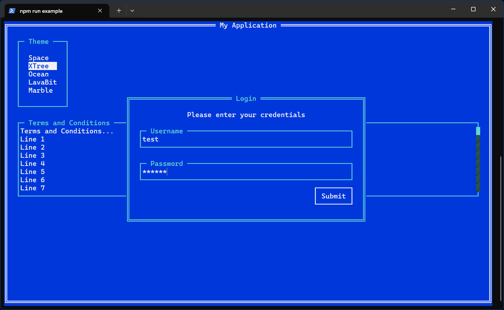
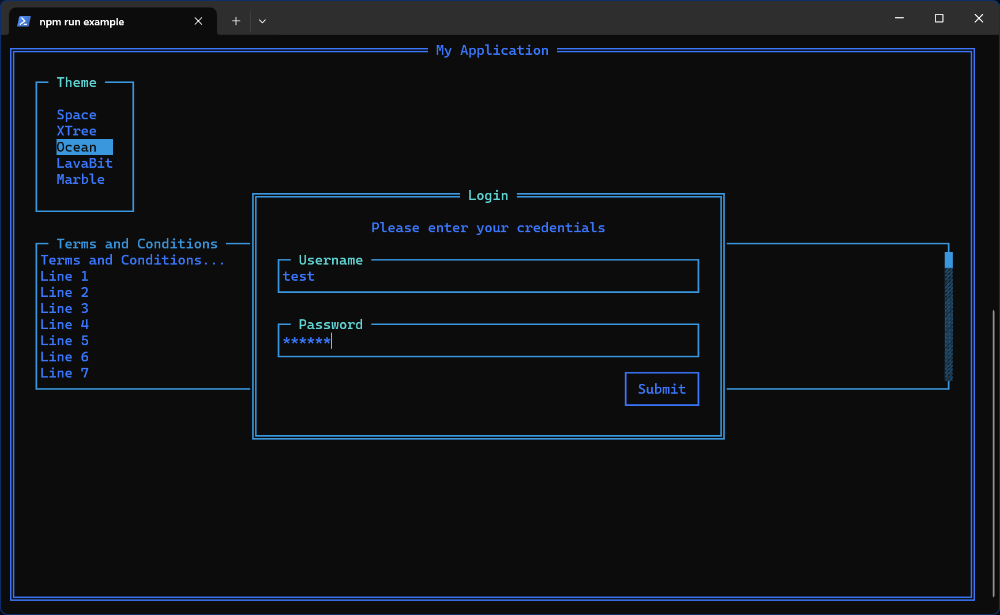
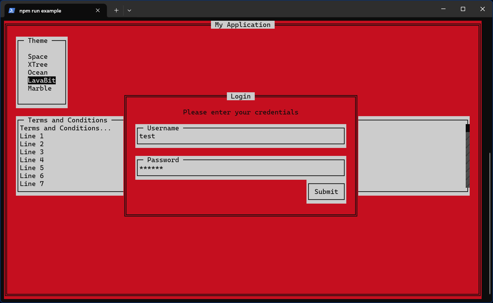
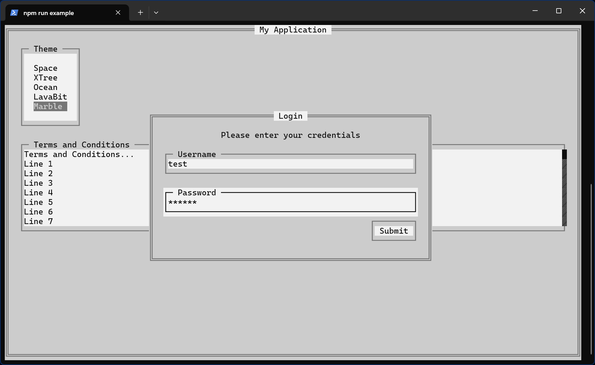

# Deluxe CLI

Build colorful complex layouts in the console!



## Features

-   Component based layouts based on the box model
-   Precise positioning supporting percentages, relative layouts and 9-point anchoring
-   Simple styling and built-in theming
-   Keyboard navigation and focus management
-   Screen and log swapping
-   No dependencies!

## Installation

```bash
npm install deluxe-cli
```

## Components

The following components are built-in

-   [Screen](#screen)
-   [Window](#window)
-   [Text](#text)
-   [Input](#input)
-   [List](#list)
-   [ScrollBar](#scrollbar)
-   [Button](#button)

### Screen

The root container for the component rendering tree. Screens are what get rendered to the console and can be swapped out to create different views.

#### Screen Usage

```js
import DeluxeCLI, {Screen, Theme, ORIGIN, BORDER} from "deluxe-cli";

const screenMain = new Screen({
	id: "screenMain",
	position: Screen.DEFAULT_POSITION.extend({
		labelOriginX: ORIGIN.X.CENTER //Center the label horizontally
	}),
	style: Screen.DEFAULT_STYLE.extend({
		border: BORDER.DOUBLE //Add a double border around the edge
	}),
	label: " My Application ",
	children: [listTheme, windowLogin],
	onSelect: () => {
		//Called when enter is pressed on the screen
		DeluxeCLI.destroy();
		console.log("Back to the terminal.");
	}
});

DeluxeCLI.initialize();
DeluxeCLI.clear();
DeluxeCLI.render(screenMain);

//Cascade the theme to the screen and its children
Theme.LavaBit.applyToComponent(screenMain);
```

#### Screen Methods

-   **onSelect**() | Called when the enter key is pressed on the screen

### Window

A container for other components that traps focus. Captures the enter/escape keys and bubbles other key presses to the parent.

#### Window Usage

```js
import {Window} from "deluxe-cli";

const windowLogin = new Window({
	id: "windowLogin",
	label: " Login ",
	children: [txtHeading, inputUser, inputPass, btnSubmit],
	onSelect: () => {
		//Called when enter is pressed on the window
		//TODO: Login logic
		windowLogin.remove();
	}
});
```

#### Window Properties

-   **userClosable** | Optional default: false | boolean | Whether the escape key should close the window

#### Window Methods

-   **onClose**() | Called when the escape key is pressed on the window
-   **onSelect**() | Called when the enter key is pressed on the window

### Text

A textbox for displaying text and handling word wrapping.

#### Text Usage

```js
import {Text, ORIGIN} from "deluxe-cli";

const txtHeading = new Text({
	id: "txtHeading",
	value: "Please enter your credentials",
	position: Text.DEFAULT_POSITION.extend({
		originX: ORIGIN.X.CENTER //Center the text horizontally
	})
});
```

#### Text Properties

-   **value** | Optional default: "" | string | The text to display

#### Text Methods

-   **wordWrap**(text, charsPerLine) | Called automatically and returns an array of lines of text that fit within the given width

### Input

A focusable text field for capturing user input. Captures characters in the allowed character set as well as backspace and delete. Other key presses bubble to the parent.

#### Input Usage

```js
import {Input} from "deluxe-cli";

const inputUser = new Input({
	id: "inputUser",
	label: " Username ",
	position: Input.DEFAULT_POSITION.extend({
		marginTop: 1,
		marginRight: 2,
		marginBottom: 1,
		marginLeft: 2
	}),
	onChange: ({value}) => {
		//Called when the value of the input changes
	}
});
const inputPass = inputUser.extend({
	id: "inputPass",
	label: " Password ",
	mask: Input.DEFAULT_MASK,
	onChange: ({value}) => {
		//Called when the value of the input changes
	}
});
```

#### Input Properties

-   **value** | Optional default: "" | string | The initial value of the input
-   **maxLength** | Optional default: 0 | number | The maximum length of the input
-   **mask** | Optional default: null | string | The character to use as a mask for the input
-   **allowedCharacters** | Optional default: Input.DEFAULT_ALLOWED_CHARACTERS | string | The characters allowed in the input

##### Input Methods

-   **onChange**({value}) | Called when the value of the input changes

### List

A focusable list of items that can be navigated and selected. Captures up/down arrow keys and the enter key. Arrow keys and other key presses bubble to the parent.

#### List Usage

```js
import {List} from "deluxe-cli";

const listTheme = new List({
	id: "listTheme",
	label: " Theme ",
	items: ["Space", "XTree", "Ocean", "LavaBit", "Marble"],
	position: List.DEFAULT_POSITION.extend({
		marginTop: 1,
		marginRight: 2,
		marginBottom: 1,
		marginLeft: 2,
		paddingTop: 1,
		paddingRight: 2,
		paddingBottom: 1,
		paddingLeft: 2
	}),
	autoSelect: true,
	onSelect: ({selectedItem}) => {
		Theme[selectedItem.trim()].applyToComponent(screen);
	}
});
```

#### List Properties

-   **items** | Required default: [] | string[] | The items to display in the list
-   **selectedIndex** | Optional default: 0 | number | The index of the selected item
-   **activeIndex** | Optional default: 0 | number | The index of the active (focused) item
-   **autoSelect** | Optional default: false | boolean | Whether onSelect should fire when the active item changes

#### List Methods

-   **onSelect**({selectedIndex, selectedItem}) | Called when the selected item changes or the enter key is pressed
-   **onChange**({activeIndex, activeIndex}) | Called when the active item changes
-   **gotoPrevious**() | Moves the active item previous
-   **gotoNext**() | Moves the active item next
-   **gotoIndex**(index) | Moves the active item to the given index

### ScrollBar

A focusable vertical scrollbar for text and lists. Captures up/down arrow keys. Other key presses bubble to the parent.

#### ScrollBar Usage

```js
import {Text, ScrollBar} from "deluxe-cli";

const txtTandC = new Text({
	id: "txtTandC",
	value:
		"Terms and Conditions...\n" +
		new Array(100)
			.fill(1)
			.map((_, i) => `Line ${i + 1}`)
			.join("\n"),
	position: Text.DEFAULT_POSITION.extend({
		width: "100%"
		//No height 100% because height 0 = auto height
	})
});

const sbTxtTandC = new ScrollBar({
	id: "sbTxtTandC",
	position: ScrollBar.DEFAULT_POSITION.extend({
		width: "100%",
		height: "10",
		marginLeft: 2,
		marginRight: 2
	}),
	label: " Terms and Conditions ",
	children: [txtTandC]
});
```

#### ScrollBar Properties

-   **scrollPosition** | Optional default: 0 | number | The current scroll position between 0 and 1

#### ScrollBar Notes

-   If the ScrollBar contains a list, you should set focusable to false on the ScrollBar to avoid a double focus scenario.

### Button

A focusable button that will trigger an event on the enter key. Other key presses bubble to the parent.

#### Button Usage

```js
import {Button} from "deluxe-cli";

const btnSubmit = new Button({
	id: "btnSubmit",
	value: "Submit",
	position: Button.DEFAULT_POSITION.extend({
		marginRight: 2,
		marginBottom: 1
	}),
	onSelect: () => {
		//Called when enter is pressed on the button
	}
});
```

#### Button Properties

-   **value** | Optional default: "" | string | The text to display on the button

#### Button Methods

-   **onSelect**() | Called when the enter key is pressed on the button

## DeluxeCLI API

The main static interface for rendering components to the console.

### DeluxeCLI Constants

-   DEFAULT_FPS | 10 | The default frames per second
-   DEFAULT_AUTO_UPDATE | true | Whether to automatically re-render on reactive prop updates

### DeluxeCLI Properties

-   **debug** | Optional default: false | boolean | Whether to log debug information to the console
-   **paused** | Optional default: false | boolean | Whether to pause rendering

### DeluxeCLI Methods

-   **initialize**({fps = DEFAULT_FPS, autoUpdate = DEFAULT_AUTO_UPDATE} = {}) | Initializes the console for rendering
-   **destroy**() | Destroys the console rendering
-   **clear**() | Clears the screen
-   **getWindowSize**() | Returns the size of the console window
-   **render**(screen, force = false) | Renders the sccreen to the console
-   **showLog**(messages = null) | Shows messages from the render log and hides the screen
-   **hideLog**() | Hides the render log and shows the screen
-   **focus**(component) | Focuses on a focusable component
-   **focusFirst**() | Focuses on the first focusable component
-   **focusNext**() | Focuses on the next focusable component
-   **exit**() | Clear and reset the console and then terminate the process

## Core

The following core classes are used to build the components.

-   [Component](#component)
-   [Position](#position)
-   [Style](#style)
-   [Theme](#theme)
    -   [Theme Built-in](#theme-built-in)
        -   [Space](#space)
        -   [XTree](#xtree)
        -   [Ocean](#ocean)
        -   [LavaBit](#lavabit)
        -   [Marble](#marble)
-   [Constants](#constants)
    -   [ROOT](#root)
    -   [POSITION](#position)
    -   [ORIGIN](#origin)
    -   [BORDER](#border)
    -   [CURSOR](#cursor)
    -   [COLORS](#colors)

### Component

The base class for all components.

#### Component Properties

-   **id** | Required default: null | string | The unique identifier for the component
-   **label** | Optional default: "" | string | The text to display above the component
-   **focusable** | Optional default: false | boolean | Whether the component can be focused
-   **focusTrap** | Optional default: false | boolean | Whether the component traps focus
-   **focusStyle** | Optional default: null | Style | The style to apply when the component is focused
-   **position** | Optional default: new Position() | Position | The position of the component
-   **style** | Optional default: new Style() | Style | The style of the component

#### Component Methods

-   **clone**() | Returns a new instance of the component with the same properties
-   **extend**(props) | Returns a new instance of the component with the given properties merged in
-   **compute**(params, {force = false, delta = 0, debug = false} = {}) | Recalculates the position and style of the component and its chil**dren**
-   **computeStyle**({parentComputedStyle} = {}, overrides = {}) | Recalculates the style of the component
-   **computePosition**({parentComputedPosition, previousChildPosition}, overrides = {}) | Recalculates the position of the component
-   **render**(parent) | Renders the component to the console
-   **drawBackground**() | Draws the background to the console
-   **drawBorder**() | Draws the border to the console
-   **drawLabel**() | Draws the label to the console
-   **drawString**(str) | Draws a string to the console
-   **drawSelf**() | Draws the component to the console
-   **renderChildren**() | Renders the children of the component to the console
-   **onFocus**() | Called when the component is focused
-   **onBlur**() | Called when the component focus is lost
-   **onKeyPress**(str, key) | Called when a key is pressed on a focused component or its children
-   **addChild**(child) | Adds a child to the component
-   **removeChild**(child) | Removes a child from the component
-   **remove**() | Removes the component itself from its parent
-   **needsRender**(fromParent, debug = false) | Returns true if the component needs to be rendered
-   **isRendered**() | Returns true if the component is currently part of the rendered tree

### Position

The class for defining and computing the position of a component. The position is computed with respect to the parent's position/size and the previous child's position/size. If the previous child's origin is the same as this origin then the positioning is relative to the previous child. Supports percentages for the width/height. Based on the CSS box model. If the labelOriginX is null then the label follows the originX.

#### Position Properties

-   **originX** | Optional default: ORIGIN.X.LEFT | string | The horizontal alignment of the component
-   **originY** | Optional default: ORIGIN.Y.TOP | string | The vertical alignment of the component
-   **x** | Optional default: 0 | number | The horizontal position of the component relative to the origin
-   **y** | Optional default: 0 | number | The vertical position of the component relative to the origin
-   **width** | Optional default: 0 | number | The width of the component
-   **height** | Optional default: 0 | number | The height of the component
-   **marginTop** | Optional default: 0 | number | The margin above the component
-   **marginRight** | Optional default: 0 | number | The margin to the right of the component
-   **marginBottom** | Optional default: 0 | number | The margin below the component
-   **marginLeft** | Optional default: 0 | number | The margin to the left of the component
-   **borderSize** | Optional default: 0 | number | The size of the border around the component which gets set automatically if a border is defined
-   **paddingTop** | Optional default: 0 | number | The padding above the component
-   **paddingRight** | Optional default: 0 | number | The padding to the right of the component
-   **paddingBottom** | Optional default: 0 | number | The padding below the component
-   **paddingLeft** | Optional default: 0 | number | The padding to the left of the component
-   **labelOriginX** | Optional default: null | string | The horizontal alignment of the label

#### Position Methods

-   **clone**(intoPosition = null) | Returns a new instance of the position with the same properties
-   **extend**(props, intoPosition = null) | Returns a new instance of the position with the given properties merged in
-   **compute**(parentPosition, {previousChildPosition = null, intoPosition = null} = {}, overrides = {}) | Returns a new Position filled with the computed values
-   **calcDimension**(input, parentSize, margin) | Returns the calculated x/y dimension while parsing percentages
-   **getScrollContentRange**() | Returns the range of the scrollable content
-   **shouldCopyProp**(prop) | Returns true if the given property should be copied when cloning. By default ignores methods and properties starting with "\_"

### Style

The class for defining and computing the style of a component. The style is computed and inherits from the parent's style.

#### Style Properties

-   **backgroundColor** | Optional default: null | string | The background color of the component
-   **color** | Optional default: null | string | The text color of the component
-   **border** | Optional default: null | string | The border style of the component
-   **borderBackgroundColor** | Optional default: null | string | The background color of the border
-   **borderColor** | Optional default: null | string | The color of the border
-   **labelBackgroundColor** | Optional default: null | string | The background color of the label
-   **labelColor** | Optional default: null | string | The color of the label
-   **underline** | Optional default: false | boolean | Whether the content should be underlined

#### Style Methods

-   **clone**(intoStyle = null) | Returns a new instance of the style with the same properties
-   **extend**(fromStyle, soft = false, intoStyle = null) | Returns a new instance of the style with the given properties merged in
-   **compute**compute(parentStyle, {intoStyle} = {}, overrides = {}) | Returns a new Style filled with the computed values
-   **shouldCopyProp**(prop) | Returns true if the given property should be copied when cloning. By default ignores methods and properties starting with "\_"

### Theme

The class for defining and applying themes to components. Themes consist of a map of component types/ids to styles and focus styles.

#### Theme Properties

-   **map** | Required default: {} | object | A map of component types/ids to styles
-   **focusMap** | Optional default: {} | object | A map of component types/ids to focus styles

#### Theme Methods

-   **applyToComponent**(component) | Applies the theme to the given component and its children

#### Theme Built-in

The following built-in themes are available

##### Space


```js
import {Theme} from "deluxe-cli";
Theme.Space.applyToComponent(screen);
```

##### XTree


```js
import {Theme} from "deluxe-cli";
Theme.XTree.applyToComponent(screen);
```

##### Ocean



```js
import {Theme} from "deluxe-cli";
Theme.Ocean.applyToComponent(screen);
```

##### LavaBit



```js
import {Theme} from "deluxe-cli";
Theme.LavaBit.applyToComponent(screen);
```

##### Marble



```js
import {Theme} from "deluxe-cli";
Theme.Marble.applyToComponent(screen);
```

### Constants

The following constants are available

#### ROOT

The root component id

```js
import {ROOT} from "deluxe-cli";
console.log(ROOT); //"root"
```

#### POSITION

The position type

```js
import {POSITION} from "deluxe-cli";
```

-   **POSITION.RELATIVE** | "relative"
-   **POSITION.ABSOLUTE** | "absolute"

#### ORIGIN

Origin positioning

```js
import {ORIGIN} from "deluxe-cli";
```

##### ORIGIN.X

-   **ORIGIN.X.LEFT** | "left"
-   **ORIGIN.X.CENTER** | "center"
-   **ORIGIN.X.RIGHT** | "right"

##### ORIGIN.Y

-   **ORIGIN.Y.TOP** | "top"
-   **ORIGIN.Y.CENTER** | "center"
-   **ORIGIN.Y.BOTTOM** | "bottom"

#### BORDER

Border styles

```js
import {BORDER} from "deluxe-cli";
```

-   **BORDER.NONE** | null
-   **BORDER.SINGLE** | Object with characters | {topLeft, topRight, bottomLeft, bottomRight, horizontal, vertical}
-   **BORDER.DOUBLE** | Object with characters | {topLeft, topRight, bottomLeft, bottomRight, horizontal, vertical}

#### CURSOR

Node cursor styles

```js
import {CURSOR} from "deluxe-cli";
process.stdout.write(CURSOR.RESET);
```

-   **CURSOR.RESET** | Reset the cursor style
-   **CURSOR.BOLD** | Set the cursor style to bold
-   **CURSOR.DIM** | Set the cursor style to dim
-   **CURSOR.ITALIC** | Set the cursor style to italic
-   **CURSOR.UNDERLINE** | Set the cursor style to underline
-   **CURSOR.OVERLINE** | Set the cursor style to overline
-   **CURSOR.BLINK** | Set the cursor style to blink
-   **CURSOR.RAPID_BLINK** | Set the cursor style to rapid blink
-   **CURSOR.INVERSE** | Set the cursor style to inverse
-   **CURSOR.HIDDEN** | Set the cursor style to hidden
-   **CURSOR.STRIKETHROUGH** | Set the cursor style to strikethrough

#### COLORS

Node color styles

```js
import {COLORS} from "deluxe-cli";
```

##### COLORS.FG

Foreground colors

-   **COLORS.FG.BLACK**
-   **COLORS.FG.RED**
-   **COLORS.FG.GREEN**
-   **COLORS.FG.YELLOW**
-   **COLORS.FG.BLUE**
-   **COLORS.FG.MAGENTA**
-   **COLORS.FG.CYAN**
-   **COLORS.FG.WHITE**
-   **COLORS.FG.BLACK_BRIGHT**
-   **COLORS.FG.RED_BRIGHT**
-   **COLORS.FG.GREEN_BRIGHT**
-   **COLORS.FG.YELLOW_BRIGHT**
-   **COLORS.FG.BLUE_BRIGHT**
-   **COLORS.FG.MAGENTA_BRIGHT**
-   **COLORS.FG.CYAN_BRIGHT**
-   **COLORS.FG.WHITE_BRIGHT**

##### COLORS.BG

Background colors

-   **COLORS.BG.BLACK**
-   **COLORS.BG.RED**
-   **COLORS.BG.GREEN**
-   **COLORS.BG.YELLOW**
-   **COLORS.BG.BLUE**
-   **COLORS.BG.MAGENTA**
-   **COLORS.BG.CYAN**
-   **COLORS.BG.WHITE**
-   **COLORS.BG.BLACK_BRIGHT**
-   **COLORS.BG.RED_BRIGHT**
-   **COLORS.BG.GREEN_BRIGHT**
-   **COLORS.BG.YELLOW_BRIGHT**
-   **COLORS.BG.BLUE_BRIGHT**
-   **COLORS.BG.MAGENTA_BRIGHT**
-   **COLORS.BG.CYAN_BRIGHT**
-   **COLORS.BG.WHITE_BRIGHT**

### RenderLog

The class for logging the rendering of components. Logs to a separate buffer that can be swapped with the current screen.

```js
import DeluxeCLI, {RenderLog} from "deluxe-cli";

RenderLog.clear();
RenderLog.log("Some info");

//Display the render log on CTRL+L
let showingLog = false;
DeluxeCLI.onKeyPress = (str, key) => {
	//ctrl+l to view render log
	if (key.ctrl === true && key.name === "l") {
		showingLog = !showingLog;
		if (showingLog) {
			DeluxeCLI.showLog();
		} else {
			DeluxeCLI.hideLog();
		}
	}
};
```

## Utils

The following utility classes are available

-   [Logger](#logger)
-   [NormalTimer](#normaltimer)

### Logger

This class is used to log messages to memory/console/file with different levels of severity. A singleton is created by DeluxeCLI.initialize() and you can log directly to this instance via static methods. All instance methods are available on the static instance. Use _Logger.getInstance()_ to get the instance if needed for advanced usage.

#### Logger Static Constants

-   **LEVEL** | The levels of the logger

    -   **LEVEL.DEBUG** = 0
    -   **LEVEL.INFO** = 1
    -   **LEVEL.LOG** = 2
    -   **LEVEL.WARN** = 3
    -   **LEVEL.ERROR** = 4

-   **OUTPUT** | The outputs of the logger

    -   **OUTPUT.MEMORY** = 1
    -   **OUTPUT.CONSOLE** = 2
    -   **OUTPUT.FILE** = 4

-   **TOKEN** | The tokens for formats

    -   **TOKEN.LEVEL** = "level"
    -   **TOKEN.TIMESTAMP** = "timestamp"
    -   **TOKEN.MESSAGE** = "message"
    -   **TOKEN.STACK** = "stack"

-   **FORMAT** | The formats for the logger
    -   **FORMAT.TIMESTAMP** = "YYYY-MM-DD HH:mm:ss.SSS"
    -   **FORMAT.FILENAME** = "YYYY-MM-DD.log"
    -   **FORMAT.MEMORY** = "level: message"
    -   **FORMAT.CONSOLE** = "message"
    -   **FORMAT.FILE** = "\[timestamp\] \[level\] message\n"
    -   **FORMAT.ERROR_MESSAGE** = "message\n stack\n"

#### Logger Static Methods

-   **createInstance**(options) | Create a new instance of the logger
-   **destroyInstance**() | Destroy the instance of the logger
-   **getInstance**() | Get the instance of the logger

Note: After creating an instance, the instance methods are available statically on the Logger class.

#### Logger Properties

-   **output** | Required default: Logger.OUTPUT.CONSOLE | number | Bitmask of the log outputs such as Logger.OUTPUT.CONSOLE | Logger.OUTPUT.FILE
-   **level** | Required default: Logger.LEVEL.INFO | number | The level of the logger
-   **levelMemory** | Optional default: null | number | The level of the memory logger
-   **levelConsole** | Optional default: null | number | The level of the console logger
-   **levelFile** | Optional default: null | number | The level of the file logger
-   **filePath** | Optional default: null | string | The file directory to write logs to
-   **formatFileName** | Optional default: "YYYY-MM-DD.log" | string | The format of the generated file name
-   **formatTimestamp** | Optional default: "YYYY-MM-DD HH:mm:ss.SSS" | string | The format of the timestamp
-   **formatMemory** | Optional default: "level: message" | string | The format when logging to memory
-   **formatConsole** | Optional default: "message" | string | The format when logging to the console
-   **formatFile** | Optional default: "\[timestamp\] \[level\] message\n" | string | The format when logging to a file
-   **formatErrorMessage** | Optional default: "message\n stack\n" | string | The format when logging an error
-   **memorySize** | Optional default: 100 | number | The number of messages to keep in memory

#### Logger Methods

-   **debug**(...args) | Log a debug message
-   **info**(...args) | Log an info message
-   **log**(...args) | Log a message
-   **warn**(...args) | Log a warning message
-   **error**(...args) | Log an error message
-   **doLog**(level, ...args) | Log a message with the given level
-   **toMemory**(level, ...args) | Log a message to memory
-   **toConsole**(level, ...args) | Log a message to the console
-   **toFile**(level, ...args) | Log a message to a file
-   **clearMemory**() | Clear the memory log
-   **\_formatMessage**(format, level, ...args) | Format a message
-   **\_formatError**(format = Logger.FORMAT.ERROR_MESSAGE, err) | Format an error message
-   **\_formatFileName**(format = Logger.FORMAT.FILENAME) | Format a file name
-   **\_formatTimestamp**(format = Logger.FORMAT.TIMESTAMP) | Format a timestamp

### NormalTimer

A class used to measure time differences in milliseconds.

#### NormalTimer Properties

-   **startTime** | The start time in milliseconds
-   **lastTime** | The last time in milliseconds

#### NormalTimer Methods

-   **elapsed**() | Returns the time elapsed since the start time
-   **tick**() | Returns the time elapsed since the last time and sets the last time to the current time

## TODO

-   Support x/y percents for absolute positioning
-   Add ScrollBar List example
-   Add colored Text value example
-   Add Checkbox component
-   Add Radio component
-   Add icons to the project?
    -   https://symbl.cc/en/
    -   Example: Unicode _Star_ = `\u2606`

## Known issues

-   Windows Terminal resize event does not fire when using snapping controls

    -   Solution: Manually resize the terminal window

-   Windows Terminal rendering shows vertical gaps between lines when using the font "Cascadia Mono"
    -   Solution: Change the font or enable the new text renderer "AtlasEngine" in Windows Terminal
    -   Additional information:
        -   https://github.com/microsoft/terminal/issues/14654
        -   https://github.com/microsoft/cascadia-code/issues/577
